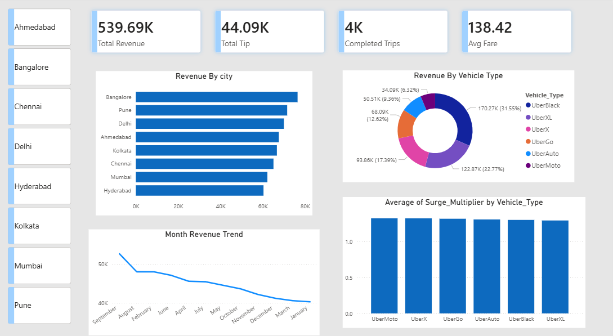
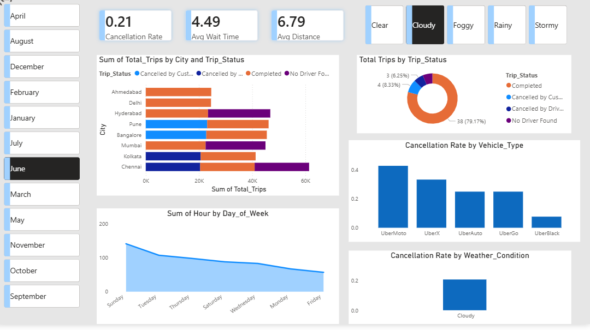
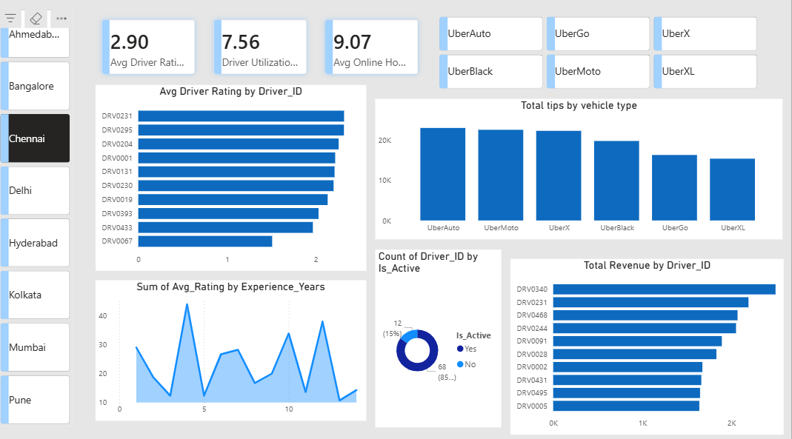
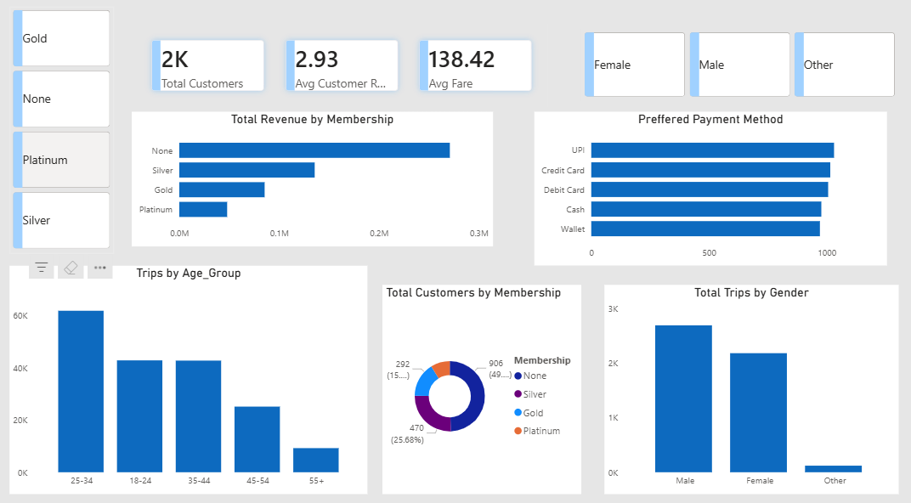

# 🚗 RideEase Transport Analytics — Power BI Dashboard

## 📌 Project Overview
An advanced multi-page Power BI dashboard analyzing ride-hailing 
operations for RideEase across 8 major Indian cities. This project 
covers revenue analysis, trip operations, driver performance, and 
customer insights for the year 2024.

---

## 🎯 Business Problems Solved
- 📉 Where and why is revenue being lost?
- ❌ Why are trips getting cancelled?
- ⭐ Which drivers are underperforming?
- 👥 Who are our most valuable customers?
- 🕐 When and where is demand highest?

---

## 📊 Dashboard Pages

### Page 1 — Revenue Overview

### Page 2 — Trip Operations

### Page 3 — Driver Performance

### Page 4 — Customer Insights

---

## 📁 Dataset Details
| Table | Rows | Description |
|---|---|---|
| Trips_Data | 5,000 | All trip records |
| Drivers_Data | 500 | Driver profiles |
| Customers_Data | 1,830 | Customer profiles |

---

## 🔑 Key Insights
- 💰 Total Revenue: **539.69K**
- 🚗 Total Trips: **5,000**
- ✅ Completed Trips: **4K**
- ❌ Cancellation Rate: **21%**
- ⭐ Avg Driver Rating: **2.90**
- 👥 Total Customers: **2K**
- 🏆 Top City by Revenue: **Bangalore**
- 💳 Most Used Payment: **UPI**
- 👶 Most Active Age Group: **25-34**

---

## 🛠️ Tools Used
- **Power BI Desktop** — Dashboard creation
- **Microsoft Excel** — Data storage
- **DAX** — Custom measures and calculations
- **Power Query** — Data transformation

---

## 📐 DAX Measures Created
- Total Revenue
- Total Trips
- Completed Trips
- Cancellation Rate
- Avg Fare
- Avg Driver Rating
- Avg Wait Time
- Revenue Per KM
- Driver Utilization Rate
- Total Customers

---

## 🗂️ Files in This Repository
| File | Description |
|---|---|
| `RideEase_Dashboard.pbix` | Power BI Dashboard file |
| `RideEase_Dataset.xlsx` | Raw dataset |
| `revenue_overview.png` | Page 1 screenshot |
| `trip_operations.png` | Page 2 screenshot |
| `driver_performance.png` | Page 3 screenshot |
| `customer_insights.png` | Page 4 screenshot |

---

## 👨‍💻 Author
**Bipin Singh**
- GitHub: [@bipinsingh2004](https://github.com/bipinsingh2004)
